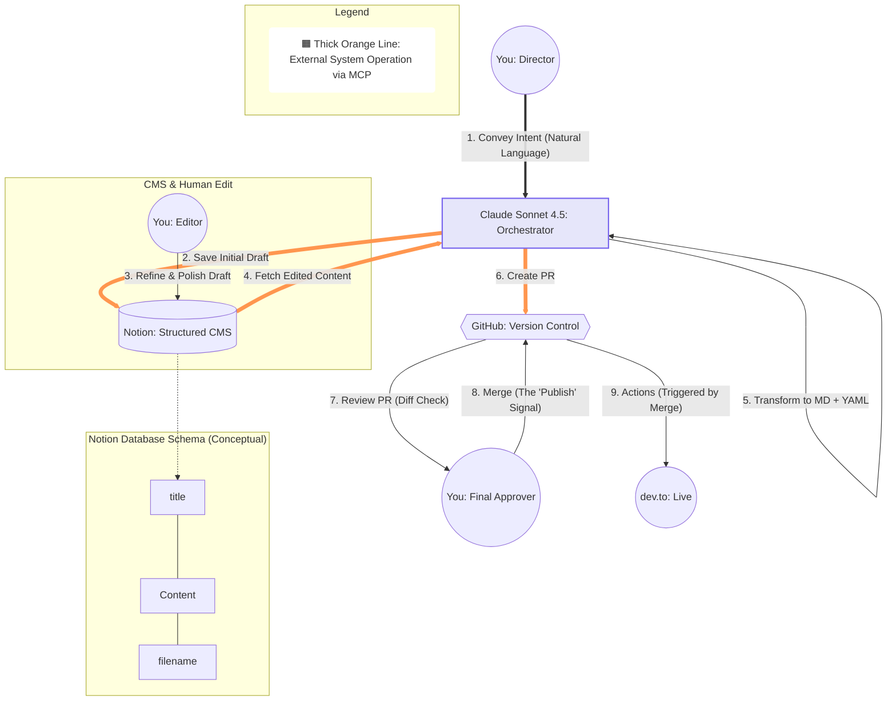

# Zero-Friction Publishing: A Human-in-the-Loop Agentic CMS powered by Notion MCP

This is the exact repository where I approved my own submission for the Notion MCP challenge, triggering a GitHub Actions workflow that automatically published it to dev.to. 

Before hitting merge, the workflow started with this simple conversation:

> **Me:**  Fetch and convert to markdown the draft with the `filename` "notion-mcp-challenge.md" from the Notion database. Then, use the python script to generate the JSON payload. 
>
>When you pass that payload to the GitHub tool, please just use the exact output from the script as-is. Don't try to rewrite or format the JSON yourself, and please don't remove any newlines. Just pass the raw result directly.
>
>Finally, create a PR targeting `main`, using the branch name specified in its `github_branch` property.
> 
> **Claude:** Got it. Let me read the properties via Notion MCP. I'll format the content with YAML frontmatter, create the branch you specified, and open a Pull Request for you.

*(This repository serves as the actual CI/CD engine for my Agentic Headless CMS!)*

## 🏗 Workflow Overview

This diagram shows the overview of the workflow I presented. It defines the interaction between the AI Orchestrator (Claude), the Human Director, and the external systems.

## 🛠 Setup & Configuration

### 1. Notion Schema

The AI orchestrator relies on this specific schema to manage the publishing lifecycle. 

To make the AI orchestrator act predictably, I defined a strict schema in the Notion Database:

* **title**: The main headline of your post.
* **published**: A boolean to control visibility.
* **description**: Used for SEO and dev.to's summary.
* **tags**: Automates categorization.
* **organization_username**: Allows publishing under a specific dev.to organization.
* **canonical_url**: Maintains SEO integrity for cross-posted content.
* **cover_image**: Managed via URL to handle article headers.
* **filename**: The exact ID for the `.md` file in the GitHub repo.
* **github_branch**: Tells the AI which branch to target for the PR.

### 2. MCP Integration

The workflow relies on two core MCP servers:

* **Notion MCP Server**: For structured data I/O.

  Remote MCP servers for Notion in Claude Desktop are configured through Settings → Connectors. See details at https://developers.notion.com/guides/mcp/get-started-with-mcp
* **GitHub MCP Server**: For repository management and PR creation.

  MCP servers for GitHub in Claude Desktop are configured through the  `claude_desktop_config.json` file, with Docker installed on your machine.
  See details at https://github.com/github/github-mcp-server/blob/main/docs/installation-guides/install-claude.md

*Created for the [Notion MCP Challenge](https://dev.to/challenges/notion-2026-03-04).*
