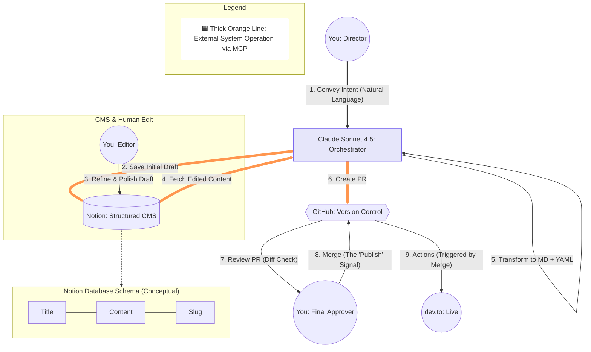

*This is a submission for the *[*Notion MCP Challenge*](https://dev.to/challenges/notion-2026-03-04)

## What I Built

While AI can generate content instantly, maintaining high quality, personal voice, and strict formatting requires a "Human-in-the-loop" approach. I built a **Zero-Friction Agentic Publishing Pipeline** that turns Notion into a collaborative Headless CMS between a human creator and an AI orchestrator. 

Instead of juggling multiple tabs, manually converting formats, or dealing with Git commands, this workflow allows me to focus entirely on directing and editing. I simply converse with my AI agent (Claude), and it handles the heavy lifting of database management, file transformation, and version control via Notion MCP.

Here is the architecture of the workflow we established:

**The Process:**

1. **Director Phase:** I initiate the idea via natural language.
2. **Drafting Phase:** The AI orchestrator generates the initial draft and saves it directly to a structured Notion database (mapping properties like `title`, `filename`, and metadata) using Notion MCP.
3. **Refinement Phase (Human-in-the-loop):** I jump into Notion—the best UI for writing—and refine the draft, adding my personal touch.
4. **Publishing Pipeline:** I tell the AI to finalize it. It fetches the updated content from Notion via MCP, transforms it into Markdown with YAML frontmatter internally, and creates a Pull Request on GitHub.
5. **Approval:** I review the PR diff and hit merge, triggering GitHub Actions to deploy the article live to dev.to.

## Video Demo

https://youtu.be/xAelmJ6MLMs

This short presentation (generated via NotebookLM based on my initial drafts) explains the philosophy behind this setup. As highlighted in the video, this is **Conversation-driven development**. You will see how I can orchestrate a complex Notion-to-GitHub pipeline without writing a single line of traditional code—relying entirely on the system architecture (the Mermaid diagram) and natural language prompts.

## Show us the code

The absolute beauty of this Agentic Workflow is that it requires **zero traditional middleware code**. By leveraging standard MCP servers, the "code" shifts from writing brittle API wrappers to defining architecture, schemas, and configurations.

This is the ultimate low-friction setup. Here is the "code" that runs the system:

**1. Architecture as Code (Mermaid)**
The Mermaid diagram in the section above *is* the core logic and source of truth for this workflow. It defines the exact boundaries between AI automation and human intervention.

**2. MCP Client Configuration (JSON)**
Instead of writing a custom integration, I simply configured my AI client to connect to the Notion and GitHub MCP servers.

**3. The Notion Schema (The "Data Model")**
The foundation that allows the AI to act predictably. Each property maps to a critical part of the GitHub/dev.to workflow:

*(💡 Note: Upload and insert your screenshot of the Notion properties here: ``)*

* **`title`**: The main headline of your post.
* **`published`**: A boolean to control visibility.
* **`description`**: Used for SEO and dev.to's summary.
* **`tags`**: Automates categorization.
* **`organization_username`**: Allows publishing under a specific dev.to organization.
* **`canonical_url`**: Maintains SEO integrity for cross-posted content.
* **`cover_image`**: Managed via URL to handle article headers.
* **`filename`**: The exact ID for the `.md` file in the GitHub repo.
* **`github_branch`**: Tells the AI which branch to target for the PR.
* **`Content`**: (The page body) The shared canvas for AI generation and human editing.

**4. Natural Language as Code (Prompts)**
In an Agentic Workflow, prompt engineering replaces scripting. The "execution" happens through plain English commands:

* **To Draft:** *"Initialize a blog post about [Topic] in Notion. Set the title and filename, then generate an outline in the page body."*
* **To Publish:** *"Retrieve the edited content from Notion via MCP (filename: [filename]). Convert it to a Markdown file with YAML frontmatter, then create a Pull Request in this repository targeting the [github_branch]."*

## How I Used Notion MCP

Notion MCP is the absolute core of this Agentic Workflow. It acts as the critical bridge that transforms Notion from a passive knowledge base into an active, collaborative workspace for AI and humans.

* **MCP Write:** I utilized the MCP to allow the LLM to dynamically create pages within my "Publishing CMS" database. It maps its generated ideas perfectly to the `title`, `filename`, and all metadata properties needed for production.
* **MCP Read:** After human intervention (my edits), the LLM uses MCP to read the exact Notion page, ensuring that the final output perfectly preserves human nuance before transforming it into strict Markdown/YAML for developers.

**What it unlocks:**
This integration completely eliminates "context switching" and "cognitive load." By leveraging Notion MCP, I don't have to copy-paste between a chat window, a text editor, and a terminal. The AI orchestrates the mundane system operations (formatting, API calls, Git commands), while I retain 100% creative control inside Notion's beautiful editing environment. This is the ultimate "human-in-the-loop" scaling system for any modern creator or developer!

---

### 💎 Proof of Concept: Dogfooding

The very article you are reading right now was orchestrated, formatted, and submitted to GitHub using this exact Notion-to-GitHub pipeline.
*"The best proof of a system is using it to build itself."*
