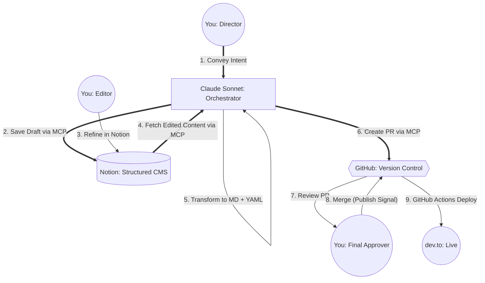

*This is a submission for the [Notion MCP Challenge](https://dev.to/challenges/notion-2026-03-04)*

## What I Built

I built a **zero-friction, human-in-the-loop publishing pipeline** that lets me go from a raw idea to a live article on dev.to — with AI doing the heavy lifting and me staying in creative control.

The system uses Claude as an AI orchestrator that talks to Notion via MCP. Here's the full flow:

1. **Director Phase** — I describe what I want to write in plain language.
2. **Drafting Phase** — Claude generates an initial draft and saves it directly to a structured Notion database (with properties like `title`, `filename`, and `tags`) using Notion MCP.
3. **Refinement Phase (Human-in-the-Loop)** — I open the Notion page — the best writing UI there is — and polish the draft with my own voice and insights.
4. **Publishing Pipeline** — I tell Claude to finalize. It fetches the updated content from Notion via MCP, transforms it into Markdown with YAML frontmatter, and opens a Pull Request on GitHub.
5. **Approval & Deploy** — I review the PR diff and hit merge. GitHub Actions takes it from there, deploying the article live to dev.to.

Notion isn't just a database here — it's the **editorial interface**. The structured schema (`title`, `filename`, `description`, `tags`, `canonical_url`) gives Claude a clean contract to read and write against, while keeping me in control of every word that ships.

## Video Demo

🎬 Video coming soon — will show a full end-to-end run: idea → Notion draft → human edit → PR → live post.

## Show us the code

> 🔗 GitHub repo link to be added — will include the GitHub Actions workflow, the Claude prompt templates, and example Notion database schema export.

## How I Used Notion MCP

Notion MCP is the backbone of this entire system. It enables **three critical operations** that make the pipeline possible:

**1. Saving the Initial Draft**
After generating the article, Claude calls Notion MCP to create a new page in the Content Database — populating structured properties (`title`, `filename`, `description`, `tags`) alongside the article body. This isn't just storing text; it's writing to a typed schema that the whole pipeline depends on.

**2. Fetching the Human-Edited Content**
Once I've refined the draft in Notion, I invoke Claude again. It uses Notion MCP to fetch the *updated* page content, picking up all my edits automatically. There's no copy-pasting, no file exports — the CMS *is* the source of truth.

**3. Creating the Pull Request**
With the final content in hand, Claude transforms it into properly formatted Markdown with YAML frontmatter and uses the GitHub MCP to open a Pull Request. The PR diff becomes my final review gate before anything goes live.

What Notion MCP *unlocks* here is **a structured, editable layer between AI generation and production deployment**. The AI doesn't publish directly — it writes *to Notion*, giving me a natural checkpoint. The schema enforces consistency, and the Notion UI makes editing feel effortless. It's the best of both worlds: AI speed with human judgment.
